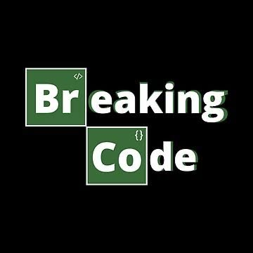

<h2 align='center'>Hi,👋 I'm Yves</h2>
<div style="background-color: #0a0a0a; padding: 20px;">


  
<table align="center" border="0" cellpadding="0" cellspacing="0" width="600" style="background-color: #0a0a0a;">
  <tr>
    <td width="200" align="center" valign="middle" style="border: 1px solid #0a0a0a;">
      
    </td>
    <td width="200" align="center" valign="middle" style="border: 1px solid #0a0a0a;">
      <br/>
      
      <br/><br/>
      
      <br/><br/>
    </td>
    <td width="200" align="center" valign="middle" style="border: 1px solid #0a0a0a;">
      
    </td>
  </tr>
</table>

</div>

**Building technology that connects people securely.**

<table align="center" border="0" cellpadding="0" cellspacing="6" style="border:none;border-collapse:separate;">
  <tr>
    <td align="center" style="border: 1px solid #0a0a0a; background-color:#0f2a1e; border-radius:6px; padding:10px 16px;">
      🌐&nbsp;<b><font color="#5dcaa5">Networking</font></b>
    </td>
    <td align="center" style="border: 1px solid #0a0a0a; background-color:#1a1a2e; border-radius:6px; padding:10px 16px;">
      🔐&nbsp;<font color="#a8a8c8">Cybersecurity</font>
    </td>
    <td align="center" style="border: 1px solid #0a0a0a; background-color:#0f2a1e; border-radius:6px; padding:10px 16px;">
      💻&nbsp;<b><font color="#5dcaa5">Full-Stack Development</font></b>
    </td>
    <td align="center" style="border: 1px solid #0a0a0a; background-color:#1a1a2e; border-radius:6px; padding:10px 16px;">
      📱&nbsp;<font color="#a8a8c8">Modern Web Applications</font>
    </td>
    <td align="center" style="border: 1px solid #0a0a0a; background-color:#0f2a1e; border-radius:6px; padding:10px 16px;">
      ⚡&nbsp;<b><font color="#5dcaa5">System Design</font></b>
    </td>
  </tr>
</table>

Currently focused on transforming ideas into products while continuously sharpening my engineering skills through real-world projects and technical challenges.

<h4>Phylosophy</h4>
<p><em>The distance between imagination and reality is engineering</em></p>

---

### Languages
`JavaScript` &nbsp; `TypeScript` &nbsp; `C` &nbsp; `C++`

### Frontend
`React` &nbsp; `Redux` &nbsp; `Tailwind CSS` &nbsp; `HTML5` &nbsp; `CSS3`

### Backend & Tools
`Node.js` &nbsp; `Express` &nbsp; `Git` &nbsp; `Database Management` &nbsp; `Cisco` &nbsp; `Thunkable` &nbsp; `Figma`

### Domains

```yaml
Networking:
  - Routing & Switching
  - Network Design
  - Troubleshooting
  - Internet of Things

Cybersecurity:
  - Secure Application Design
  - Security Best Practices
  - Threat Awareness

Software Engineering:
  - REST APIs
  - Full Stack Development
  - System Design
```

---

## Connect & Collaborate

If you're interested in:

✔️ Software Engineering  
✔️ Networking  
✔️ Innovative Tech Projects

Let's build something meaningful together.

---

<div align="center">


</div>
